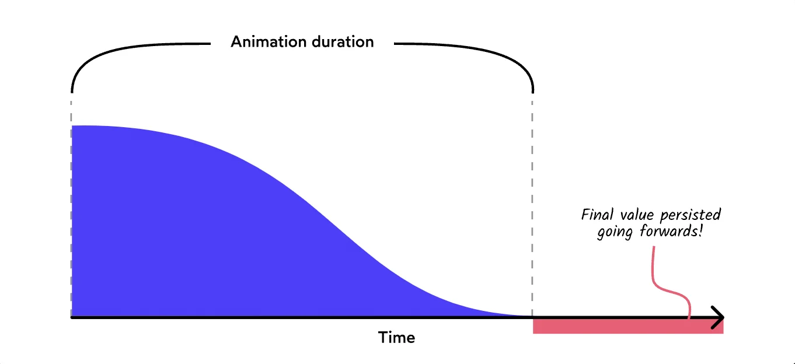
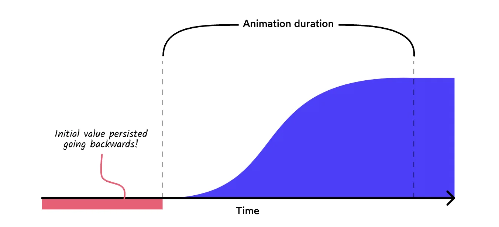
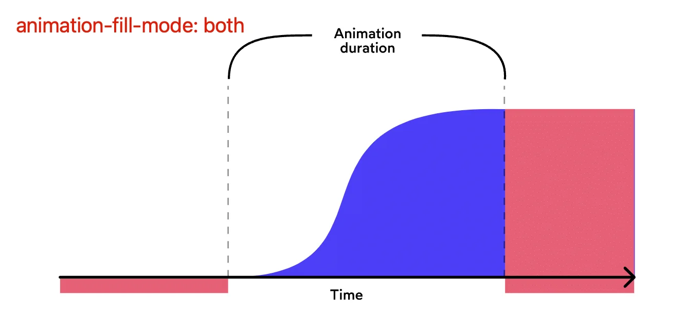

介绍一些和动画相关的理论知识：

1. [A Friendly Introduction to Spring Physics - JoshComeau](https://www.joshwcomeau.com/animation/a-friendly-introduction-to-spring-physics/) 弹簧动画

   - CSS不支持弹簧动画，需要借助JS
   - 影响弹簧动画的3大因素：
     - 物体质量（`mass`）: 质量越大，动画的惯性越大
     - 弹簧张力（`tension`）: 张力越大，弹簧的弹性势能越强，物体运动越持久
     - 摩擦力（`friction`）：摩擦力是阻碍运动的因素，摩擦力越大，物体速度衰减速率越快，比如太空不存在摩擦力，物体会一直运动

2. [An Interactive Guide to Keyframe Animations - JoshComeau](https://www.joshwcomeau.com/animation/keyframe-animations/#fill-modes-7)

   - 介绍CSS Keyframes的一些基本属性和用法

   - 最最重要的一点是，帮助理解了 `animation-fill-mode` 属性的含义，它有3个值：

     - `animation-fill-mode: forwards`: 让我们保持为动画最后结束时的状态
     - `animation-fill-mode: backwards`: 对于存在 `animation-delay` 的情况，使动画在delay结束前保持keyframes初始状态
     - `animation-fill-mode: both`: 它是上面2者的结合体

     

     

     

