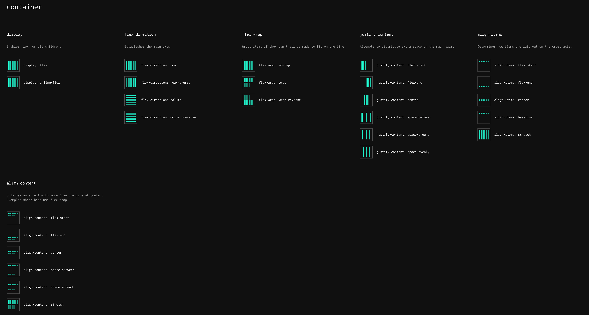
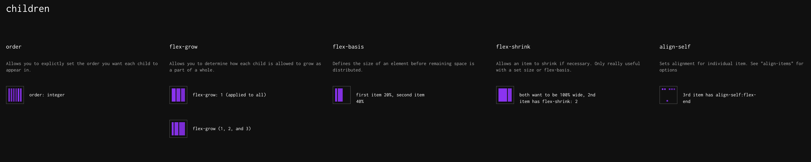
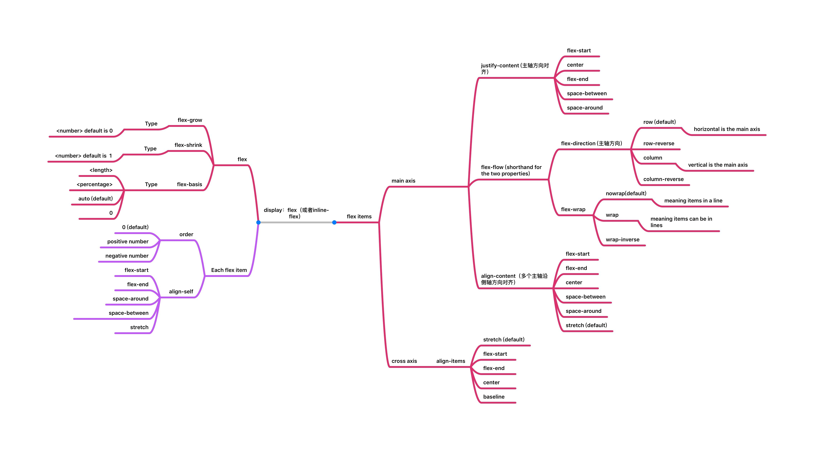
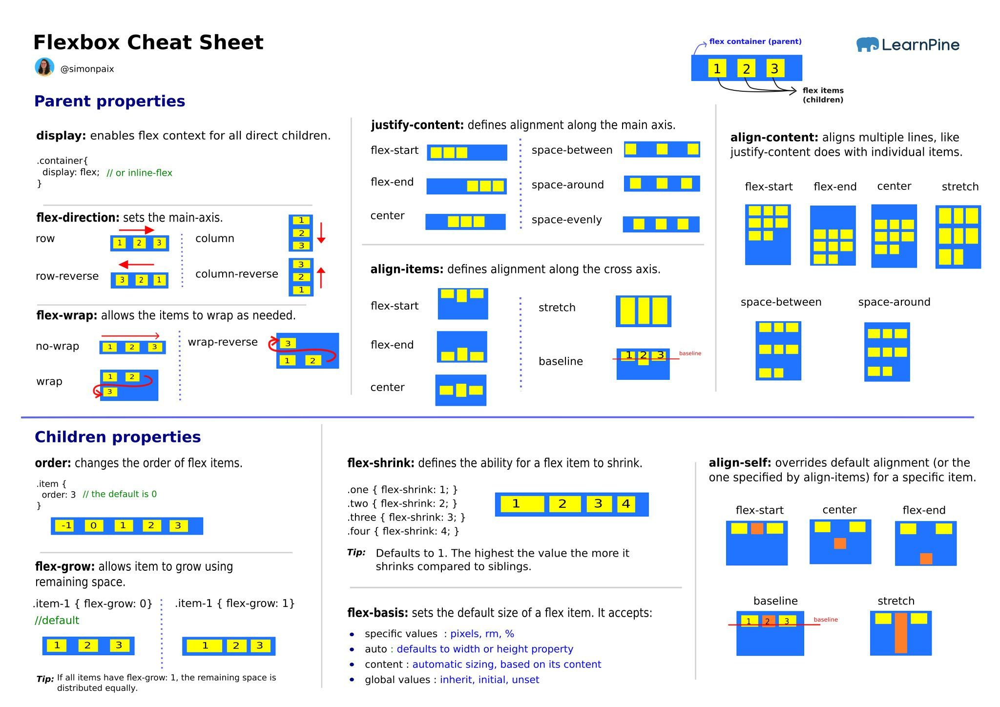

Flexbox算是很简单直白且常用的布局方式了，整体比较简单，看看CheatSheet和这篇交互式Flexbox[🔥 An Interactive Guide to Flexbox - JoshComeau](https://www.joshwcomeau.com/css/interactive-guide-to-flexbox/) 基本上就可以掌握了😃。

## CheetSheet
1. [Flexbox 可视化图](https://flexbox.malven.co/) 所有flexbox属性(除了 `gap` 属性)可视化表示形式
   
   

所有属性思维导图表示：

另一张cheatsheet:

## 教程

1. [🔥 An Interactive Guide to Flexbox - JoshComeau](https://www.joshwcomeau.com/css/interactive-guide-to-flexbox/) 最好的一篇Flexbox教程，必看
   - 交互式Flexbox教程
   - 主轴与交叉轴
   - flexbox命名规则 - `justify-content` & `align-items` & `align-self` & `align-content` 这些命名规则的由来
     - `justify` - 沿着主轴定位元素
     - `align` - 沿着交叉轴定位元素
     - `content` - 分布一组元素
     - `items` - 单个元素可以单独定位
   - flexbox假想尺寸，定义的尺寸（比如 `width`）用于简易最后的尺寸，而不是硬性尺寸
   - `flex-basis` vs `width`
   - `flex-grow` - 如果使用容器剩余可用空间，元素如何对可用空间进行抢占
   - `flex-shrink` - 当容器尺寸不够时，子元素如何进行（按比例）缩减；以及如何阻止缩减
   - 元素在浏览器中最小尺寸陷阱，如何使用 `min-width` | `min-height` 解决这一陷阱
   - `gap` 属性，如何给元素之间添加间距
   - auto margin 的用法：`margin-right: auto` | `margin-left: auto` 
   - `flex-wrap: nowrap` vs `flex-wrap: wrap` 
     - `flex-wrap: wrap` 换行时形成多个副主轴
     - `align-content` - 对换行后的多个副主轴如何进行分布
   - 如何使用Flexbox实现自适应布局
2. [🎉 a guide to flexbox - @css-tricks](https://css-tricks.com/snippets/css/a-guide-to-flexbox/) 属性详细介绍，以及可视化表示，并包含Flexbox相关的资源
3. [💯 Flexbox Froggy](https://flexboxfroggy.com/) 通过游戏的方式掌握Flexbox布局
   - 完成这些任务基本上可以强化Flexbox所有属性的用法

## 工具

介绍一些可视化配置Flexbox的工具：

1. [FlexBox Playground and Code Generator](https://the-echoplex.net/flexyboxes/) 自动生成Flexbox 

2022年12月01日14:28:49
