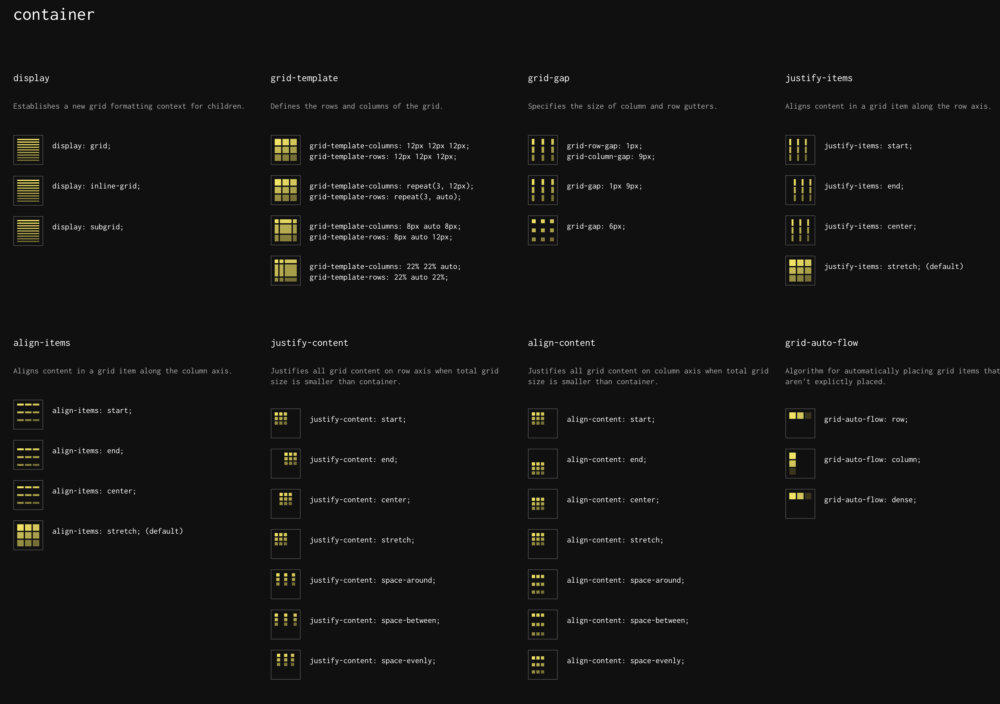
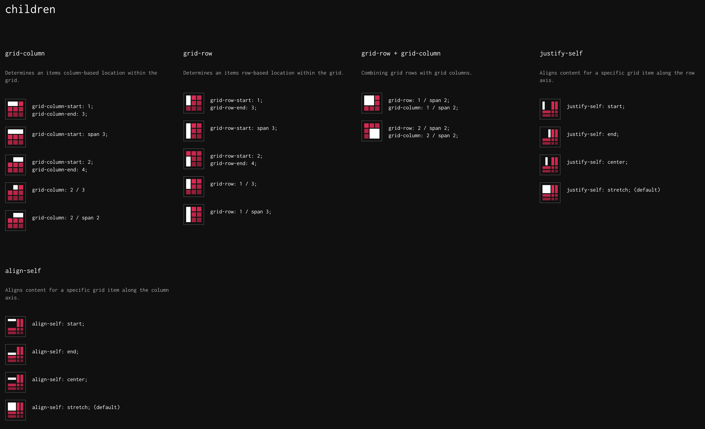

Grid是新的二维布局，flexbox着重强调一维空间，而Grid再强调二维空间的布局。两者相辅相成，一起使用，更加的强大。
Grid属性及其的多，且容易混淆，尤其是各种属性也类似，因此需要经常的查看和使用才便于记忆。

## CheatSheet

[Grid CheatSheet](https://grid.malven.co/) 快速查看Grid属性：






## 教程

1. [🔥 LearncssGrid.com](https://learncssgrid.com/) 很详尽的列举处了所有的Grid属性

   - Grid一些属性缩写：
     - `grid-gap: 100px 1rem;`: 等价于 `grid-row-gap: 100px;` & `grid-column-gap: 1rem;`。如果只写一个值，则表示row和column gap相同，即 `grid-gap: 16px;` 等价于 `grid-row-gap: 16px;` & `grid-column-gap: 16px;`
     - `grid-row: 2;` 等价于 `grid-row-start: 2;` & `grid-row-end: 3;` 
     - `grid-row: 1 / 3` 等价于 `grid-row-start: 1;` & `grid-row-end: 3;` 
     - `grid-row: 1 / span 3` 等于于 `grid-row-start: 1;` & `grid-row-end: 4;` 其中 `span` 表示横跨多少rows
     - `grid-area: 2 / 2 / 3 / 3` 依次表示 `grid-row-start / grid-column-start / grid-row-end / grid-column-end`
   - 隐式Grid，当Items项数量超过Grid规定的单元格数时：
     - `grid-auto-flow` 默认为 `row`，即垂直方向的填充，还可以定义 `grid-auto-rows: 140px;` 表示下个填充的 `rows` 的高度。
     - 可以设置 `grid-auot-flow: column;` 即水平方向填充，还可以定义 `grid-auto-columns: 1fr;` 表示填充的宽度为容器剩余宽度的 `1fr`。
   - `justify-content`: 表示当整体grid尺寸小于容器尺寸时，`水平`方向如何防止Items
   - `justify-items`: 沿行轴(即 `水平`)对齐网格项中的内容，注意和上面的 `justify-content` 的区别🚨
   - `justify-self`: 表示单个Item，自身沿水平方向怎么对其`grid cell`

2. [🚀🚀 A Complete Guide to CSS Grid](https://css-tricks.com/snippets/css/complete-guide-grid/) 这个是对上面教程的补充，更加的完整，其图形表示更加的清晰，必看🔥

   - 包含所有属性的完成语法😎

   - `place-self` 可同时设置 `<align-self> / <justify-self>` 比如 `place-self: center stretch` 表示 `align-self: center;` (即单元格内垂直方向居中) & `justify-self: stretch;` (即单元格内水平方向拉伸填充)

   - `place-items` 可同时设置 `<align-items> / <justify-items>` 这2个属性和 `flexbox` 中的 `align-items` & `justify-content` 是一样的。比如 `place-items: center;` 表示 `align-items: center;` & `justify-content: center;`

   - `place-content` 可同时设置 `<align-content> / <justify-content>` 这2个属性，它们都表示当整体大小小于grid容器大小时，整体的摆放方式。比如 `place-content: start end;` 表示 `align-content: start;`（垂直方向） & `justify-content: end;` （水平方向）

   - `grid-template` 可同时设置 `<grid-template-rows> / <grid-template-columns>`。 比如 `grid-template: 40% 60% / 200px 1fr;` 等价于 `grid-template-rows: 40% 60%;` & `grid-template-columns: 200px 1fr;`

   - 流式布局代码片段：

     ```css
     .grid-container {
       display: grid;
       /* minmax(200px, 1fr) 表示最小200px，最大 1fr */
       grid-template-columns: repeat(auto-fill, minmax(200px, 1fr));
       /* 对于小屏幕，可以使用下面方式： min(200px, 100%) 表示 200px和 100%去更小的值 */
       /* grid-template-columns: repeat(auto-fill, minmax(min(200px, 100%), 1fr)); */
       gap: 1rem;
     }
     ```

   - 包含其余一些关于Grid相关的教程和资源🔥

3. [🚀🚀 Grid By Example](https://gridbyexample.com/) 包含Grid相关大量的示例和视频，以及图解，必看🔥

4. [💯 CSS Grid Garden](https://cssgridgarden.com/) 通过游戏的方式学习Grid属性

5. [The CSS behind Figma - @ishadeed.com](https://ishadeed.com/article/figma-css/) 介绍了Figma中如何使用Flexbox & Grid进行布局的

## 工具

1. [Grid Cheatsheet online](https://yoksel.github.io/grid-cheatsheet/#section-display) 通过各种按钮选择，来理解grid属性的用法，包含所有属性语法
2. [CSS Grid Generator](https://cssgrid-generator.netlify.app/) 在线边界Grid格子，然后生成代码
3. [Grid.layoutit](https://grid.layoutit.com/) 这个也是在线生成代码，比上面的功能更强大一些😎


2022年12月27日15:35:45


