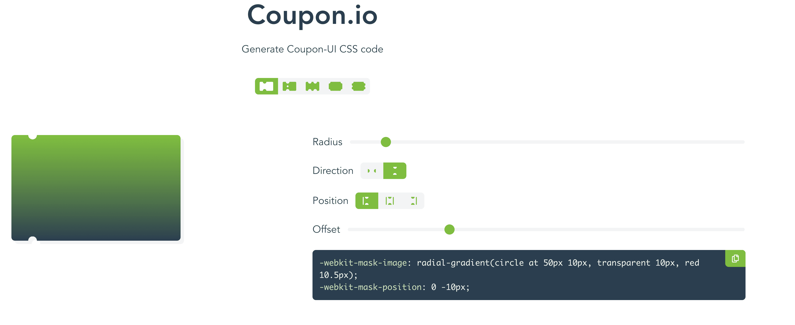
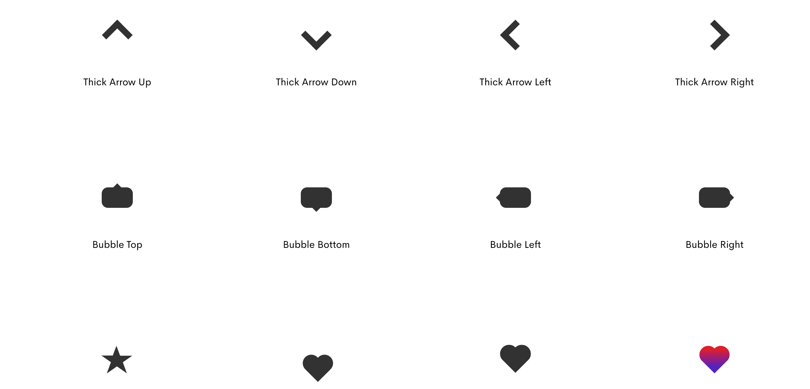

一些常用的组件CSS Snippet:

1. [Beautiful CSS checkboxes examples - getcsscan.com](https://getcssscan.com/css-checkboxes-examples?ref=beautifulboxshadow-bottom) 各式各样的checkbox样式
1. [CSS shapes examples - getcsscan.com](https://getcssscan.com/css-shapes?ref=beautifulboxshadow-bottom) CSS形状，箭头，会话框，多边形，三角形
1. [Triangle Generator - omatsuri.app](https://omatsuri.app/triangle-generator) 这个其实是一个聚合性工具🇨🇭
1. [Coupon.io](https://coupon.codelabo.cn/) Coupon样式生成
1. [Fancy Border Generator](https://9elements.github.io/fancy-border-radius/#30.30.30.46--.) 使用 `border-radius` 生成各种各样的形状😎
1. [csslayout.io](https://csslayout.io/) 各种布局组件Snippet，聚合性🇨🇭

2022年12月01日15:09:58