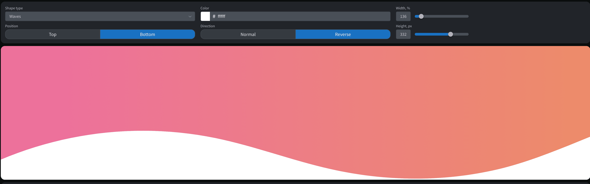

曲线生成器，多用于一些需要曲线分割的页面设计元素：

1. [GetWaves.io](https://getwaves.io/) 生成各种各样的waves 👍 直观，易用
2. [Custom Shape Dividers - shapedivider.app](https://www.shapedivider.app/) 调整曲线的尺寸，方向，颜色，各种分割样式
3. [Page Dividers - omatsuri.app](https://omatsuri.app/page-dividers) 聚合性工具，直接生成SVG代码

2022年12月01日15:16:23

