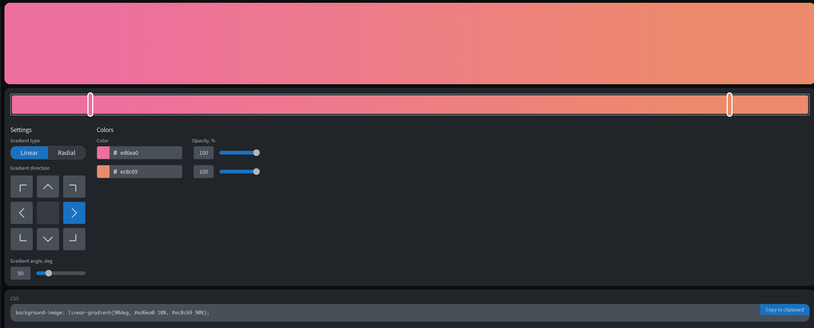

颜色渐变（`Gradients`）生成工具:

1. [Gradient-Generator - joshwcomeau](https://www.joshwcomeau.com/gradient-generator/) 美观易用
2. [cssgradient.io](https://cssgradient.io/) 包含线性渐变和径向渐变
3. [Omatsuri.app](https://omatsuri.app/gradient-generator) 这个其实是一个聚合性工具🇨🇭
4. [Animated Gradient Background Generator](https://animated-gradient-background-generator.netlify.app/) 动画渐变背景生成工具

2022年12月01日15:01:50

