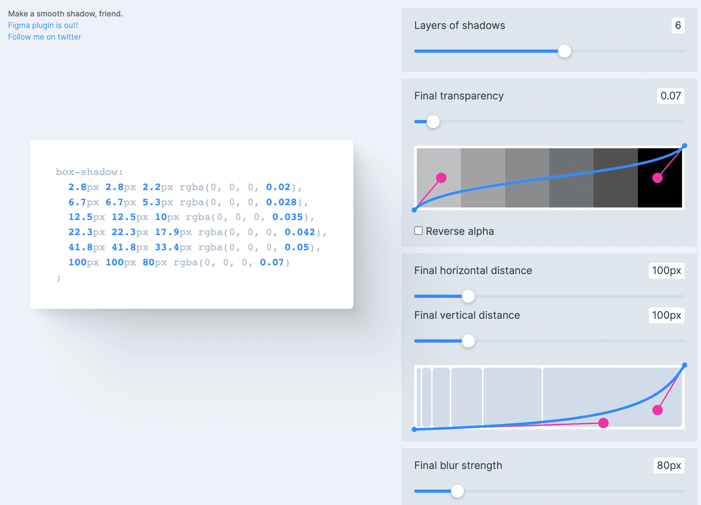

阴影（`box-shadow`）生成工具:

1. [shadow-palette - joshcomeau](https://www.joshwcomeau.com/shadow-palette/) 调整阴影位置，颜色，blur等
2. [👍 shadows-brumm.af](https://shadows.brumm.af/) 生成 `box-shadow`
3. [Beautiful CSS box-shadow examples](https://getcssscan.com/css-box-shadow-examples) 一些预定义好的阴影样式，可直接复制，包含TailwindCSS写法

2022年12月01日14:28:34

